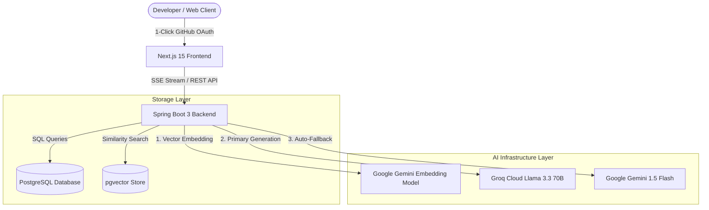

# 🚀 GetDevNode — AI-Powered Codebase Intelligence & RAG Platform

> **Chat directly with any GitHub codebase in real time. Powered by Spring Boot 3, Next.js 15, PostgreSQL `pgvector`, Groq Llama 3.3 70B, and Google Gemini.**

[](https://www.getdevnode.me)
[](https://www.oracle.com/java/)
[](https://spring.io/projects/spring-boot)
[](https://nextjs.org/)
[](https://github.com/pgvector/pgvector)

---

## 🌟 Key Features

- **⚡ 1-Click GitHub Vector Indexing**: Seamlessly fetch any GitHub repository, perform AST-aware code chunking, and store vector embeddings in PostgreSQL `pgvector`.
- **💬 Cited Codebase RAG Chat**: Ask complex architectural questions and get streaming answers complete with file paths and line-by-line code citations.
- **🔄 Multi-Key Rate Limit Auto-Rotator**: Intelligent thread-safe API key pool manager that cycles through multiple API keys on HTTP 429 rate limit errors with zero downtime.
- **🛡️ Dual AI Model Provider Engine**: Ultra-fast response generation powered by **Groq Cloud AI (`llama-3.3-70b`)** with automatic live fallback to **Google Gemini (`gemini-1.5-flash`)**.
- **📡 Server-Sent Events (SSE) Streaming**: Smooth token-by-token real-time streaming with live markdown rendering and syntax highlighting.
- **🔐 Secure OAuth Authentication**: 1-click GitHub OAuth2 authentication with encrypted session state management.

---

## 🏗️ System Architecture



---

## 🛠️ Tech Stack

| Component | Technology / Library |
|---|---|
| **Frontend** | Next.js 15 (Turbopack), React 19, TypeScript, TailwindCSS, Lucide Icons |
| **Backend** | Java 21, Spring Boot 3.4, Spring Security (OAuth2), Spring AI |
| **Database** | PostgreSQL 16+ with `pgvector` extension |
| **LLM Provider** | Groq Cloud AI (`llama-3.3-70b-versatile`), Google Gemini (`gemini-1.5-flash`) |
| **Embeddings** | Google GenAI (`gemini-embedding-001`) |
| **Deployment** | Render (Backend), Vercel (Frontend) |

---

## 🚀 Quickstart & Local Setup

### Prerequisites
- **Java 21** or higher installed
- **Node.js 18+** & `npm`
- **PostgreSQL 16+** with `pgvector` extension enabled
- Groq Cloud API Key & Google Gemini API Key

---

### 1️⃣ Clone the Repository
```bash
git clone https://github.com/shobhitkumar-1/getdevnode.git
cd getdevnode
```

### 2️⃣ Backend Setup (Spring Boot)
1. Navigate to the backend directory:
   ```bash
   cd backend
   ```
2. Configure environment variables in `application.properties` or system environment:
   ```properties
   SPRING_DATASOURCE_URL=jdbc:postgresql://localhost:5432/getdevnode
   SPRING_DATASOURCE_USERNAME=postgres
   SPRING_DATASOURCE_PASSWORD=yourpassword

   GROQ_API_KEYS=gsk_key1,gsk_key2
   GEMINI_API_KEYS=AIzaSyKey1,AIzaSyKey2
   ```
3. Run the backend application:
   ```bash
   ./mvnw spring-boot:run
   ```
   *Backend will start on `http://localhost:8080`*

---

### 3️⃣ Frontend Setup (Next.js)
1. Open a new terminal and navigate to the client directory:
   ```bash
   cd client
   ```
2. Install dependencies:
   ```bash
   npm install
   ```
3. Create a `.env.local` file:
   ```env
   NEXT_PUBLIC_API_BASE_URL=http://localhost:8080
   ```
4. Start the development server:
   ```bash
   npm run dev
   ```
   *Frontend will start on `http://localhost:3000`*

---

## 📌 Environment Variables Reference

### Backend (`application.properties`)
| Variable | Description |
|---|---|
| `SPRING_DATASOURCE_URL` | PostgreSQL JDBC Connection String |
| `SPRING_DATASOURCE_USERNAME` | Database username |
| `SPRING_DATASOURCE_PASSWORD` | Database password |
| `GROQ_API_KEYS` | Single or comma-separated Groq API keys pool |
| `GEMINI_API_KEYS` | Single or comma-separated Gemini API keys pool |
| `GITHUB_CLIENT_ID` | GitHub OAuth App Client ID |
| `GITHUB_CLIENT_SECRET` | GitHub OAuth App Client Secret |

---

## 🌐 Live Platform & Links

- **Live Platform**: [https://www.getdevnode.me](https://www.getdevnode.me)
- **Author**: Shobhit Kumar ([@kumarshobhit-1](https://github.com/kumarshobhit-1))

---

## 📄 License

Distributed under the MIT License. See `LICENSE` for more information.
